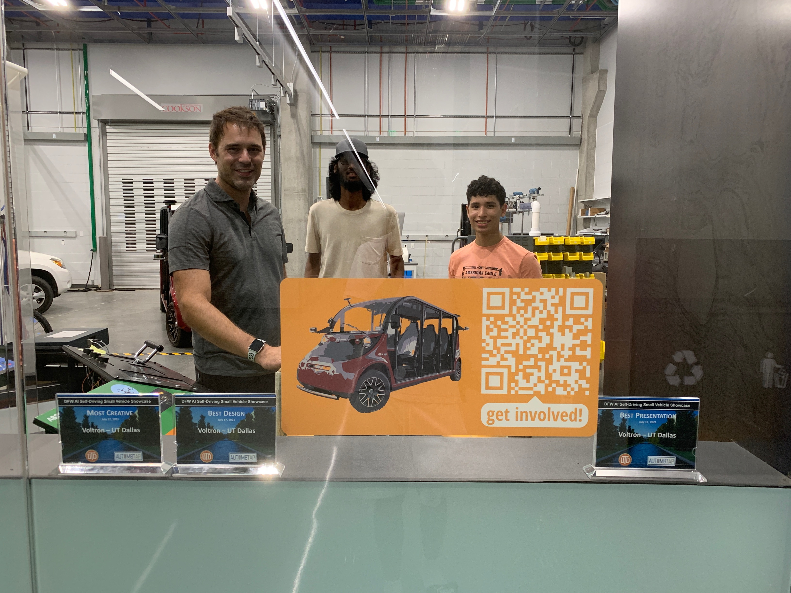

# Roll With Us
We're Voltron, UT Dallas's applied autonomous driving project. We've already come a long way, but we need your help to go further than ever.

In our first major milestone, Demo 1, Voltron steered itself through the real world. We're now working to write a new behavior planner, a steering controller, an ML-based obstacle detector, and more. To learn more about our current goals, check out the [Demo 2 overview](/d2-overview).

<small>Dr. Ruths, Vishvak, and Cristian after the DFW self-driving expo this summer (👀 those awards...)</small>
## Open positions

### Software/Algorithm Developer (C++)
Do algorithms like Normal Distribution Transform and Extended Kalman Filters excite you? Are you able to learn on your own, dive into source code, and write clean applications?

Software developers on our team do more than write code. You should have strong math and communication skills, be comfortable learning new skills on your own, and enjoy working with like-minded developers on a team.

### Web Developer
Our robot reads lots of sensor data and makes lots of calculations. All this data forms a thick web that's often confusing for humans to understand. We'd like to **write a web interface** that can parse data from our stack and visualize it all through a web app.

You should have experience in front-end development (React, Angular, or similar) and backend development (Flask, Node, or similar).

### 3D Artist
Before we test our code on our real car, we first [run everything in a simulator](/simulation/2021/08/03/Simulated-driving.html). We'd love to have a custom model for [our car](https://gem.polaris.com/en-us/e6/build-color/?selectedmodel=passengerlsv&colorid=617275), as well as a 3D environment to represent areas of UT Dallas's campus. 

There are lots of other areas of our project that would keep a 3D artist busy: visualizations, GUI animations, proofs of concept, and so on.

### Public Relations Director
This person would serve as our liason to our campus community and the outside world. They would write updates and post them on our website, take pictures and videos of our work, and possibly manage our social media presence.

How many PR specialists get to promote a self-driving car laboratory? Exactly.

## Requirements for all positions
- **Good teamwork**: Voltron is a group of friendly, supportive people, and we want you to be a part.
- **Pride in our mission**: If you think self-driving cars are awesome, then we're looking for you!
- Most importantly, **dedication**. Our goals are tough-- way harder than most people realize. Our work is often frustrating and slow. We're looking for people who can stick with it, who know that all the frustration is worth it. Here's a quote from [an article](https://www.bloomberg.com/news/articles/2021-08-17/waymo-s-self-driving-cars-are-99-of-the-way-there-the-last-1-is-the-hardest) about Waymo, a self-driving car company with a bit more resources than us:

> At first, it appeared that Waymo would produce cars at a supercharged pace. In 2018, Waymo signed up to turn as many as 20,000 Jaguar SUVs into Waymo autonomous vehicles. Months later, it said it would expand its fleet of Chrysler Pacifica minivans to more than 60,000. Waymo planned to buy the cars and install what it called its “Driver”—a suite of cameras, sensors, and proprietary computer gear.

> “There’s not a lot in assembly,” then-CEO John Krafcik, a former auto executive, declared at an event that year.
In reality, skilled disassembly is required. Engineers must take apart the cars and put them back together by hand. One misplaced wire can leave engineers puzzling for days over where the problem is...

- More specifically, you should be able to dedicate **5 hours per week** through the school year-- no, this doesn't mean finals week.
- If you're worried that you don't have enough experience, but you're still really interested, **apply anyway**. Dedication is more valuable than experience. Try your best with the sample submission, and we'd still like to interview you afterwards.

## Application process
Our application has three parts: The form, the sample submission, and the interview. Everyone who submits the form and their sample will be invited to an interview. Applications will be reviewed on a rolling basis. We're really looking forward to hearing from you! **You can access the form and submit your samples here: [Form and Sample Submissions](https://forms.office.com/Pages/ResponsePage.aspx?id=HR0ojU2c90uxbgMtFd6fbIFd-Rv8Ml9PhLjL-3yimtVUNkxZUzZDNjFBRTFYTkNaOFpKWkhLM0c5OS4u)**.

## Sample submissions
### Software/Algorithm Developer
If applying for the *Software/Algorithm Developer* position, please review the following:

We'd like Voltron to drive in a big loop around our simulated map, "GoMentum Station". Our behavior planner, which generates a trajectory for the car to follow, needs a global route as an input.

The global route is a sequence of Lanelet2 lanes encoded in a [HADMapRoute message](https://gitlab.com/autowarefoundation/autoware.auto/autoware_auto_msgs/-/blob/master/autoware_auto_msgs/msg/HADMapRoute.idl) from Autoware.Auto.

Using the starter code provided [here](), please write a ROS2 Foxy node that publishes our global route as a HADMapRoute message onto the topic `/planning/global_route`. Submit a link to your code using the form linked above.

Feel free to use our development environment, [VDE](https://github.com/Voltron-UTD/vde), to test your code. You can, however, forgo VDE and use any other tool that you wish, as long as the finished product works.

If you have questions, please see our own [wiki](https://github.com/Voltron-UTD/meta/wiki) and other resources available online. We're partly looking to see if you can figure things out on your own.

### Web Developer
Please send us a link to a website that you've developed in the past. The more skills demonstrated in the website (e.g. backend development, user interface design, etc), the better.

### 3D Artist
Please send us some examples of your work. We're not picky: Renderings, mockups, anything else you might find relevant.

### PR Director
Please do one of the following, or both:
- Send us some examples of your past work. These could be blog posts, photos, illustrations, screenshots of social media posts, and so on.
- Suppose we'd like to invite community members to join us as spectators for the completion of Voltron's [Grand Tour](/d2-overview), our first full lap around campus. Design some materials to promote this event. This can be as simple or as ambitious as you like, but the more creative, the better. We'd like to get a sense of your style.

All sample submissions should be sent through our [Form and Sample Submissions](https://forms.office.com/Pages/ResponsePage.aspx?id=HR0ojU2c90uxbgMtFd6fbIFd-Rv8Ml9PhLjL-3yimtVUNkxZUzZDNjFBRTFYTkNaOFpKWkhLM0c5OS4u)** page.

We're really looking forward to hearing from you. Should you have any questions, you can contact the team lead, Will, at *will.heitman@utdallas.edu*. Best of luck!
