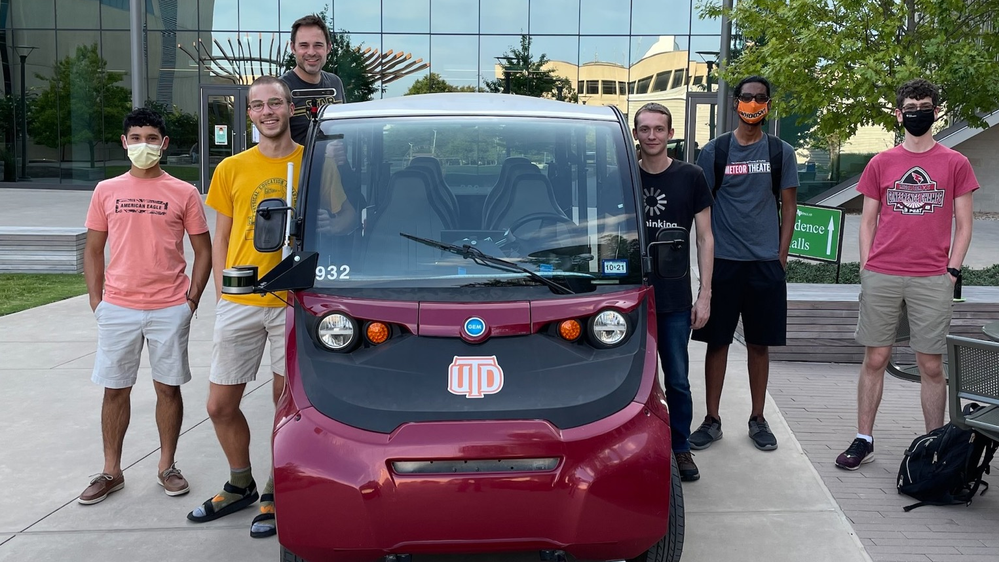

# Roll With Us
We're Voltron, UT Dallas's applied autonomous driving project. We've already come a long way, but we need your help to go further than ever.

In our first major milestone, Demo 1, Voltron steered itself through the real world. We're now working to write a new behavior planner, a steering controller, an ML-based obstacle detector, and more. To learn more about our current goals, check out the [Demo 2 overview](/d2-overview).

<small>Our team celebrating the completion of Demo 1</small>
## Open positions

***Applications for our current recruitment period are now closed. We do not have a date for new openings as of yet.***

## Requirements for all positions
- **Good teamwork**: Voltron is a group of friendly, supportive people, and we want you to be a part.
- **Pride in our mission**: If you think self-driving cars are awesome, then we're looking for you!
- Most importantly, **dedication**. Our goals are tough-- way harder than most people realize. Our work is often frustrating and slow. We're looking for people who can stick with it, who know that all the frustration is worth it. Here's a quote from [an article](https://www.bloomberg.com/news/articles/2021-08-17/waymo-s-self-driving-cars-are-99-of-the-way-there-the-last-1-is-the-hardest) about Waymo, a self-driving car company with a bit more resources than us:

> At first, it appeared that Waymo would produce cars at a supercharged pace. In 2018, Waymo signed up to turn as many as 20,000 Jaguar SUVs into Waymo autonomous vehicles. Months later, it said it would expand its fleet of Chrysler Pacifica minivans to more than 60,000. Waymo planned to buy the cars and install what it called its “Driver”—a suite of cameras, sensors, and proprietary computer gear.

> “There’s not a lot in assembly,” then-CEO John Krafcik, a former auto executive, declared at an event that year.
In reality, skilled disassembly is required. Engineers must take apart the cars and put them back together by hand. One misplaced wire can leave engineers puzzling for days over where the problem is...

- More specifically, you should be able to dedicate **5 hours per week** through the school year-- no, this doesn't mean finals week.
- If you're worried that you don't have enough experience, but you're still really interested, **apply anyway**. Dedication is more valuable than experience. Try your best with the sample submission, and we'd still like to interview you afterwards.

## Application process
Our application has three parts: The form, the sample submission, and the interview. After you submit the form, we'll email you about your sample and interveiw. In other words, the form is your first step. Applications will be reviewed on a *rolling basis*. We're really looking forward to hearing from you! **You can access the form here: [Form and Sample Submissions](https://forms.office.com/Pages/ResponsePage.aspx?id=HR0ojU2c90uxbgMtFd6fbIFd-Rv8Ml9PhLjL-3yimtVUNkxZUzZDNjFBRTFYTkNaOFpKWkhLM0c5OS4u)**.

## Sample submissions
### Software/Algorithm Developer
If applying for the Software/Algorithm Developer position, please see our instructions [here](/fall-recruiting/dev-samples).

### Web Developer
Please show us a website that you've developed in the past. The more skills demonstrated in the website (e.g. backend development, user interface design, etc), the better.

### 3D Artist
Please show us some examples of your work. We're not picky: Renderings, mockups, anything else you might find relevant.

### PR Director
Please do one of the following, or both:
- Show us some examples of your past work. These could be blog posts, photos, illustrations, screenshots of social media posts, and so on.
- Suppose we'd like to invite community members to join us as spectators for the completion of Voltron's [Grand Tour](/d2-overview), our first full lap around campus. Design some materials to promote this event. This can be as simple or as ambitious as you like, but the more creative, the better. We'd like to get a sense of your style.

### Education and Outreach Director
There's no sample submission-- hooray! We'd love to chat about ideas you might have for curriculum though during your interview.

---

We're really looking forward to hearing from you. Should you have any questions, you can contact the team lead, Will, at *will.heitman@utdallas.edu*. Best of luck!

<a href="https://forms.office.com/Pages/ResponsePage.aspx?id=HR0ojU2c90uxbgMtFd6fbIFd-Rv8Ml9PhLjL-3yimtVUNkxZUzZDNjFBRTFYTkNaOFpKWkhLM0c5OS4u" class="button" target="_blank">Application Form</a>
