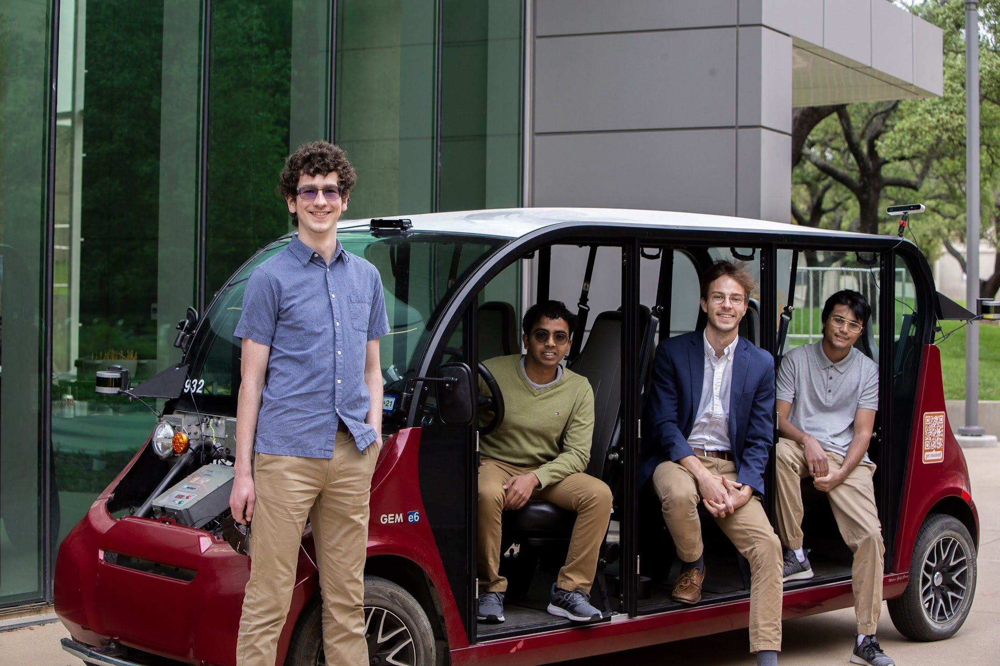

 
We are excited to announce openings for the 2022-2023. Full position descriptions and applications will be posted on <b>Monday, August 29th</b>. See below.

# Roll With Us
We're Nova, UT Dallas's applied autonomous driving project. We aim to create the first open-source autonomous driving platform in Texas-- period. We've already come a long way, but we need your help to go further than ever.

Our open-source software, "Navigator," is under active development, with over 500 commits across our branches. However, there's plenty of work ahead with our perception software, planning algorithms, and more. If you're a believer in autonomous-driving, we need your help!

<small>Above: Some of our members at a fundraising event in April</small>

## Open positions
### Development lead
The dev lead will...

### Core developer
Core developers...

### Vehicle engineers
Vehicle engineers will...

### PR director
The PR director will...

## Requirements for all positions
- **Good teamwork**: Voltron is a group of friendly, supportive people, and we want you to be a part.
- **Pride in our mission**: If you think self-driving cars are awesome, then we're looking for you!
- Most importantly, **dedication**. Our goals are tough-- way harder than most people realize. Our work is often frustrating and slow. We're looking for people who can stick with it, who know that all the frustration is worth it. Here's a quote from [an article](https://www.bloomberg.com/news/articles/2021-08-17/waymo-s-self-driving-cars-are-99-of-the-way-there-the-last-1-is-the-hardest) about Waymo, a self-driving car company with a bit more resources than us:

> At first, it appeared that Waymo would produce cars at a supercharged pace. In 2018, Waymo signed up to turn as many as 20,000 Jaguar SUVs into Waymo autonomous vehicles. Months later, it said it would expand its fleet of Chrysler Pacifica minivans to more than 60,000. Waymo planned to buy the cars and install what it called its “Driver”—a suite of cameras, sensors, and proprietary computer gear.
> “There’s not a lot in assembly,” then-CEO John Krafcik, a former auto executive, declared at an event that year.
In reality, skilled disassembly is required. Engineers must take apart the cars and put them back together by hand. One misplaced wire can leave engineers puzzling for days over where the problem is...
- More specifically, you should be able to dedicate **5 hours per week** through the school year-- no, this doesn't mean finals week.
- If you're worried that you don't have enough experience, but you're still really interested, **apply anyway**. Dedication is more valuable than experience. Try your best with the sample submission, and we'd still like to interview you afterwards.

## Application process
Our application has two parts: The form and the sample submission. After you submit the form, we'll email you about your sample. In other words, the form is your first step. We're really looking forward to hearing from you! **You can access the form here: [Form and Sample Submissions](https://forms.office.com/Pages/ResponsePage.aspx?id=HR0ojU2c90uxbgMtFd6fbIFd-Rv8Ml9PhLjL-3yimtVUNkxZUzZDNjFBRTFYTkNaOFpKWkhLM0c5OS4u)**.

## Sample submissions
### Core Developer and Development Lead
If applying for a developer position, please see our instructions [here](/fall-recruiting/dev-samples).

### PR Director
Please do one of the following, or both:
- Show us some examples of your past work. These could be blog posts, photos, illustrations, screenshots of social media posts, and so on.
- Suppose we'd like to invite community members to join us as spectators for a large event that we're hosting (perhaps a livestream of a competition that we're part of). Design some materials to promote this event. This can be as simple or as ambitious as you like, but the more creative, the better. We'd like to get a sense of your style.

---

We're really looking forward to hearing from you. Should you have any questions, you can contact the team lead, Will, at *will.heitman@utdallas.edu*. Best of luck!

<iframe src="https://utdallas.app.box.com/f/3d1626c86b034ca6b2d32d4f97a18cfb" height="550" width="500"></iframe>

<a href="https://forms.office.com/Pages/ResponsePage.aspx?id=HR0ojU2c90uxbgMtFd6fbIFd-Rv8Ml9PhLjL-3yimtVUNkxZUzZDNjFBRTFYTkNaOFpKWkhLM0c5OS4u" class="button" target="_blank">Application Form</a>